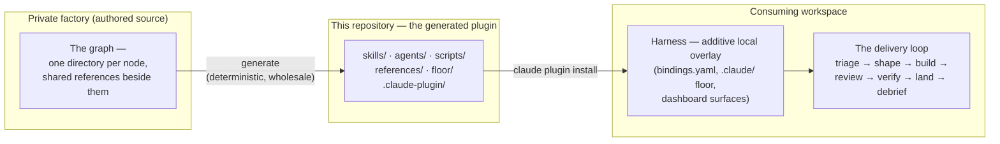

# stack-graph

**A gated, graph-built agentic engineering workflow for Claude Code — shipped as a plugin.**

stack-graph models an agent operating environment as a **graph of its `.claude` primitives** —
skills, agents, references, scripts — and runs a full delivery loop over any repository you bind
it to: work is raised, shaped, built, reviewed, verified, and landed through explicit, recorded
gates, with a transcript analyzer deriving activity and attribution analytics on the side.

Nearly everything in this repository is **generated**: a deterministic build projects a
privately authored graph wholesale into this tree. Same graph in, byte-identical tree out —
the generated-ness is the design; the short list of hand-maintained files lives in
[Contributing](#contributing).

## What this is

The plugin ships four kinds of surface:

- **Skills** — invocable workflow stages and orchestrators (`/stack-graph:triage`,
  `/stack-graph:build`, …) that move a unit of work through the loop.
- **Agents** — dispatchable specialists (review lenses, probes, measurement and curation
  helpers) that the skills fan out to.
- **References + floor** — the doctrine pages the nodes cite, plus the always-on floor page a
  workspace inlines into its root instructions.
- **Scripts** — deterministic runtime pieces: the transcript analyzer, the gate recorder, and
  a carrier-argument session hook (TypeScript, run with bun), plus a Python session-preamble
  hook.

### Core vocabulary

| Term | Meaning |
| :-- | :-- |
| **node** | One shipped `.claude` primitive — a skill, agent, or script; one directory per node in the source graph. |
| **reference** | A doctrine page a node cites; shipped under `references/` (shared) or inside a skill's own bundle. |
| **floor** | The always-on instruction layer; a workspace's harness inlines `floor/sg-root-instructions.md` into its root instructions. |
| **harness** | A consuming workspace's local, additive overlay — bindings, crystallised local surfaces, dashboard. The vendored plugin tree itself is never edited. |
| **carrier** | The recorded unit of work (a work item or implementation unit) that moves through the loop and carries its own gate decisions. |
| **gate** | An explicit, recorded decision point (e.g. commit-to-build, commit-to-land) with an append-only, hash-chained decision log. |
| **the loop** | triage → shape → build → review → verify → land → debrief — the delivery workflow the skills implement. |
| **generate** | The deterministic factory build that writes this repository's content wholesale from the authored graph. |

## Quickstart

Requires Claude Code with plugin support (see [Prerequisites](#prerequisites)). From a terminal:

```bash
claude plugin marketplace add hk121992/stack-graph-plugin
claude plugin install stack-graph@stack-graph
```

Or inside a Claude Code session: `/plugin marketplace add hk121992/stack-graph-plugin`, then
`/plugin install stack-graph@stack-graph`. Restart Claude Code (or run `/reload-plugins` if the
install summary asks for it) and the skills appear namespaced as `/stack-graph:<skill>`.

> Verified against **Claude Code v2.1.132**. The native plugin/marketplace flow is documented in
> the [official Claude Code plugin docs](https://code.claude.com/docs/en/plugins) — treat those
> as the authority if the CLI surface has moved.

## Prerequisites

- **Claude Code** — the plugin targets the native plugin/marketplace flow (version stamp above).
- **[bun](https://bun.sh)** — the TypeScript scripts (`scripts/analyzer`, `scripts/record-gate`,
  the carrier-argument hook) are executed with bun.
- **Python 3** — the session-preamble hook (`scripts/preamble/preamble.py`) runs with the
  system `python3`.
- **POSIX shell + cron** — for the optional scheduled analytics task (the analyzer derives the
  event log from session transcripts on a schedule).
- **git** — the workflow's gates and landing recipes assume a git repository.

## Workspace setup

Installing the plugin gives you the skills; a workspace becomes operable by standing up its
**harness** — the local overlay the plugin's own skills scaffold:

1. In the target workspace, run `/stack-graph:harness-init scaffold` — writes `bindings.yaml`
   (how the vendored nodes resolve this workspace's surfaces), materialises the always-on floor
   into `.claude/`, seeds the dashboard and strategy surface skeletons, and writes the analytics
   env vars.
2. **Install the scheduled analyzer task.** `harness-init` emits a runbook for the recurring
   analyzer job — the cron entry that turns session transcripts into the derived event log.
   Follow that runbook; analytics stay dark until the task is installed.
3. Run `/stack-graph:harness-init validate` — checks every required binding resolves and probes
   the analyzer with a dry run.
4. Later plugin upgrades go through `/stack-graph:harness-update`, which re-crystallises what
   the new version changed.

From there, raise work with `/stack-graph:triage` and let the loop route it.

## Architecture



Repository layout:

- `.claude-plugin/` — `plugin.json` (the plugin manifest; its `version` is build-written) and
  `marketplace.json` (the marketplace entry this repository serves).
- `skills/<id>/SKILL.md` — the workflow skills, each with a co-located `references/` bundle
  where it carries one.
- `agents/<id>.md` — the dispatchable agents.
- `references/` — the shared doctrine references (`<id>.md`), plus per-agent bundle
  directories (`references/<agent-id>/`) carrying the references each agent cites.
- `floor/` — the always-on floor page harnesses inline.
- `scripts/` — the transcript analyzer, the record-gate runner, the session hooks, and their
  shared `lib/`.

## Node catalogue

Rendered from the build's generate manifest at plugin version **0.16.13** (46 nodes, 81 placed
files). The catalogue is re-rendered when the tree is regenerated; if it ever lags a newer tree,
the shipped files win.

### Skills — the invocable workflow stages and curators (25)

| Node | Ships as |
| :-- | :-- |
| architecture-review | `skills/architecture-review/SKILL.md` |
| build | `skills/build/SKILL.md` |
| context-curator | `skills/context-curator/SKILL.md` |
| debrief | `skills/debrief/SKILL.md` |
| debug | `skills/debug/SKILL.md` |
| deploy | `skills/deploy/SKILL.md` |
| design | `skills/design/SKILL.md` |
| design-implement | `skills/design-implement/SKILL.md` |
| design-review | `skills/design-review/SKILL.md` |
| design-shotgun | `skills/design-shotgun/SKILL.md` |
| dispatch | `skills/dispatch/SKILL.md` |
| harness-init | `skills/harness-init/SKILL.md` |
| harness-update | `skills/harness-update/SKILL.md` |
| land | `skills/land/SKILL.md` |
| local-graph-maintainer | `skills/local-graph-maintainer/SKILL.md` |
| optimise | `skills/optimise/SKILL.md` |
| plan | `skills/plan/SKILL.md` |
| qa | `skills/qa/SKILL.md` |
| review | `skills/review/SKILL.md` |
| shape | `skills/shape/SKILL.md` |
| shape-product | `skills/shape-product/SKILL.md` |
| specify | `skills/specify/SKILL.md` |
| strategy-curator | `skills/strategy-curator/SKILL.md` |
| triage | `skills/triage/SKILL.md` |
| verify | `skills/verify/SKILL.md` |

### Agents — the dispatchable specialists (18)

| Node | Ships as |
| :-- | :-- |
| auto-shaper | `agents/auto-shaper.md` |
| benchmark | `agents/benchmark.md` |
| canary | `agents/canary.md` |
| capture-learnings | `agents/capture-learnings.md` |
| consistency-checker | `agents/consistency-checker.md` |
| drift-detector | `agents/drift-detector.md` |
| explore | `agents/explore.md` |
| health | `agents/health.md` |
| investigate-probe | `agents/investigate-probe.md` |
| lens-correctness | `agents/lens-correctness.md` |
| lens-maintainability | `agents/lens-maintainability.md` |
| lens-security | `agents/lens-security.md` |
| lens-tests | `agents/lens-tests.md` |
| link-validator | `agents/link-validator.md` |
| log-decision | `agents/log-decision.md` |
| measure-outcomes | `agents/measure-outcomes.md` |
| queue-checker | `agents/queue-checker.md` |
| simulate-users | `agents/simulate-users.md` |

### Scripts — the deterministic runtime pieces (3)

| Node | Ships as |
| :-- | :-- |
| carrier-arg-hook | `scripts/carrier-arg-hook/carrier-arg-hook.md` |
| preamble | `scripts/preamble/preamble.md` |
| record-gate | `scripts/record-gate/record-gate.md` |

Alongside the nodes, the build places **30 shared references** (doctrine pages) under
`references/`, **4 node-carried references** inside their owning skill's bundle, and the
always-on floor file `floor/sg-root-instructions.md` that a workspace's harness inlines into its root instructions.

## Contributing

This repository is a **build artifact**. The authored source is a private factory repository
holding the graph — one directory per node plus the shared references; a deterministic build
(`generate`) projects it into this tree **wholesale**: `skills/`, `agents/`, `references/`,
`floor/`, `scripts/`, and the `plugin.json` version field are overwritten on every release.

- **Do not hand-edit the generated directories.** A pull request that edits them cannot land
  meaningfully — the next generate erases it. The repo-owned surfaces — this README, `LICENSE`,
  `.claude-plugin/marketplace.json`, and all of `.claude-plugin/plugin.json` except its
  build-written `version` field — are the only hand-maintained files; treat this list as the
  authoritative ownership statement.
- **Where change actually happens:** in the factory graph. Bug reports and suggestions are
  welcome as [issues on this repository](https://github.com/hk121992/stack-graph-plugin/issues);
  accepted changes land here through the factory's build, not as direct commits.
- **Determinism is the contract.** The same authored graph produces a byte-identical tree (the
  build's freshness gate enforces it) — that is what makes vendoring, review, and rollback
  tractable.

## Optional integrations

- **Two-layer decision records.** The `log-decision` agent (see `agents/log-decision.md`) writes
  every recorded decision's **conclusion** to the workspace's decisions store. When the harness
  additionally binds an external personal knowledge base, the fuller **reasoning layer** is
  written there too; with no such binding, the reasoning is appended beside the conclusion in
  the decisions store, marked as a fallback — nothing is silently dropped. A few tail-stage nodes (`explore`, `capture-learnings`, the `debrief` skill) use
  the same optional binding.
- **Analytics.** The transcript analyzer is optional-but-recommended: without the scheduled
  task the workflow still runs — you just get no derived event log.

## License

MIT — see [LICENSE](LICENSE). Copyright (c) 2026 stack-graph contributors.
